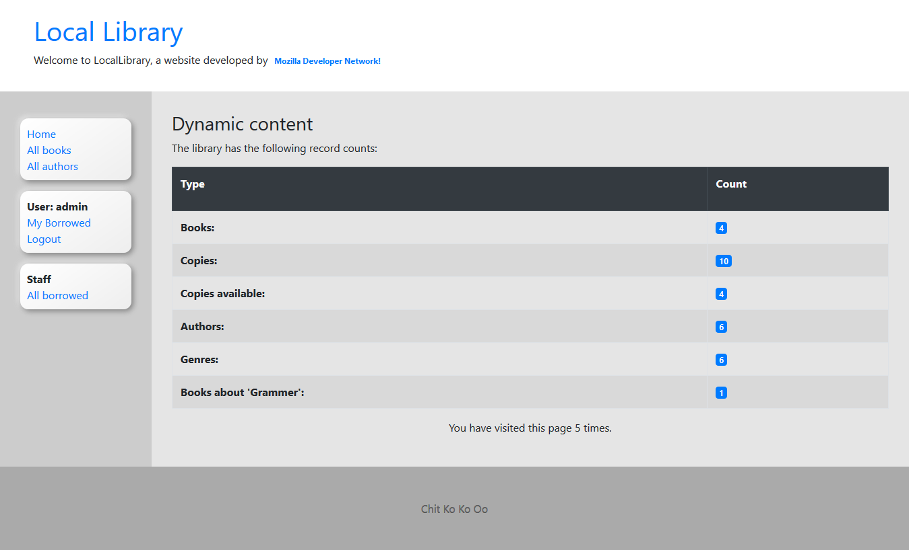
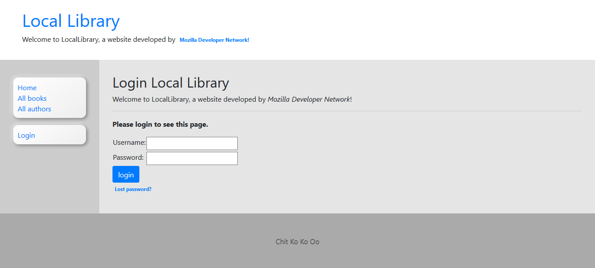
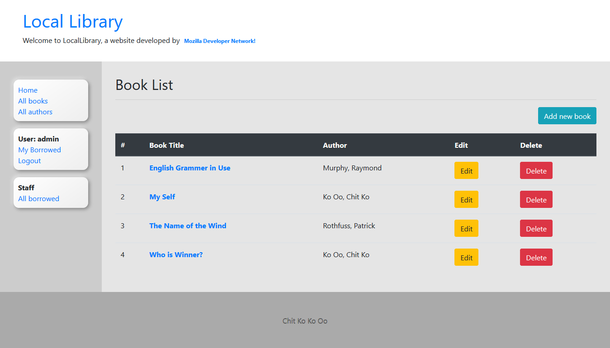
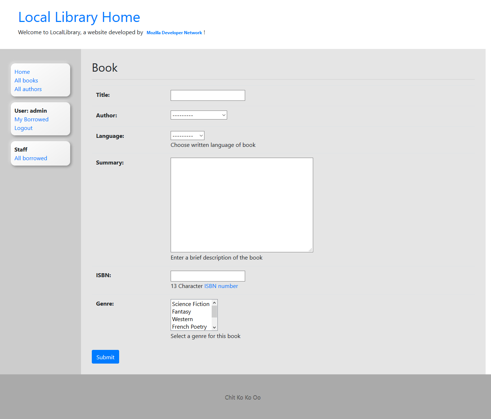
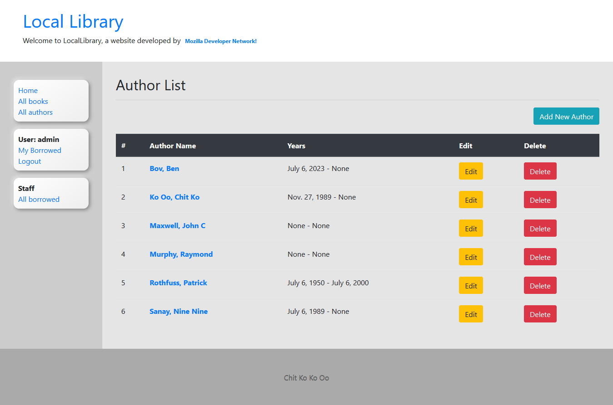
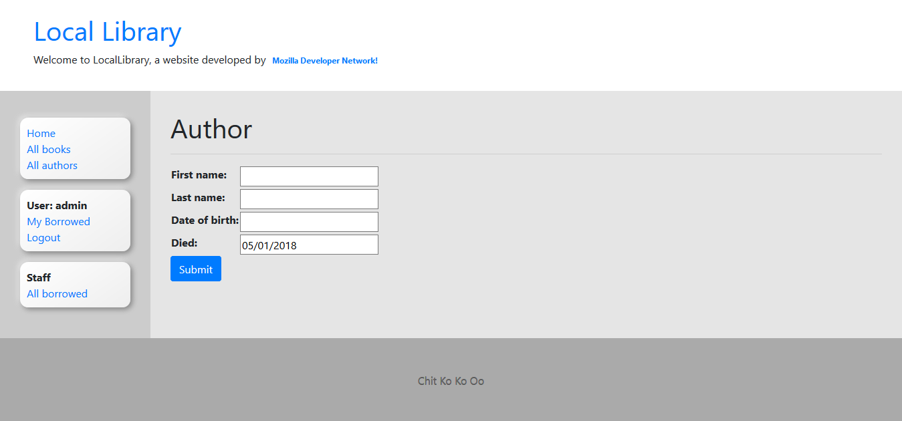
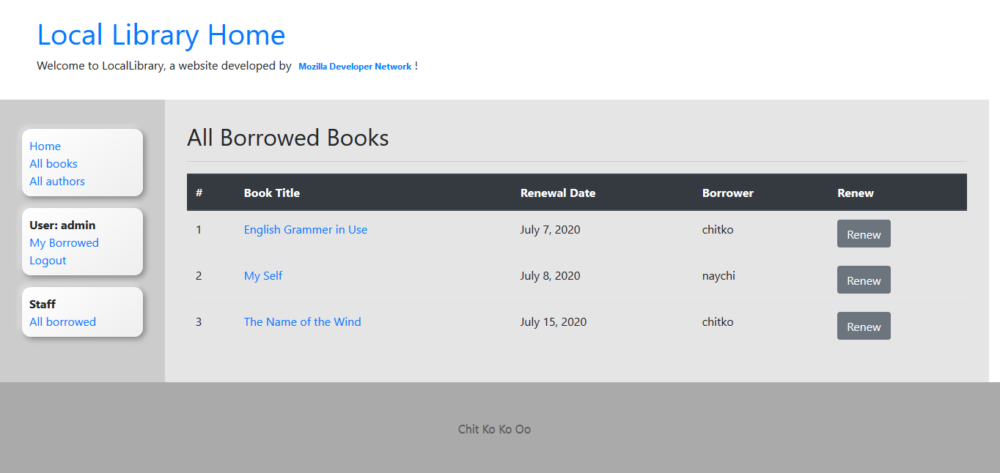
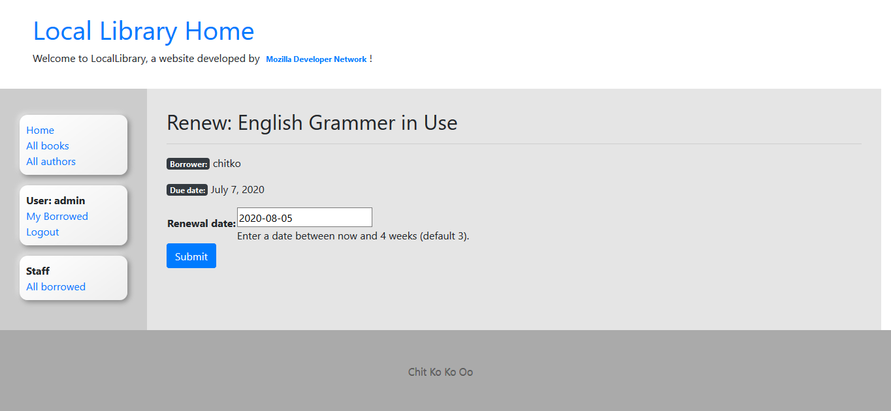

# Django Tutorial: The Local Library website #

#### This project is a original Django tutorial of MDN website and I have successfully studied and code myself. You are welcome to check my code. Moreover you can also find original tutorial and git source in the Resources section. ####

## Installation and Running ##

- Open terminal and run `git clone https://github.com/chitkokooo/LocalLibrary.git`
- `cd LocalLibrary\locallibrary` in Windows (or) `cd LocalLibrary/locallibrary` in GNU/Linux
- `python manage.py makemigrations`
- `python manage.py migrate`
- `python manage.py collectstatic`
- `python manage.py runserver`
- Open `http://127.0.0.1:8000` in web browser

## Resources ##

[Python](https://www.python.org) | [Django](https://www.djangoproject.com) | [Bootstrap](https://getbootstrap.com)

BootStrap CDN Link (`https://stackpath.bootstrapcdn.com/bootstrap/4.5.0/css/bootstrap.min.css`)

[Official MDN LocalLibrary Website Tutorial](https://developer.mozilla.org/en-US/docs/Learn/Server-side/Django)

[MDN Official Project](https://github.com/mdn/django-locallibrary-tutorial)

## Users ##

### Admin User ###
`username: admin`
`password: admin`

### Librarian ###
`username: librarian`
`password: locallibrary`

### Library Members ###
`username: chitko`
`password: locallibrary`

`username: naychi`
`password: locallibrary`

## Screenshots ##

Home Page

Login Page

Book List

Add New Book

Author List

Add New Author

All Borrowed Books

Renew Borrowed Book

Book Detail

Author Detail

## About Me ##

[LinkedIn](https://www.linkedin.com/in/chitkokooo-cu/)

Email: chitkokooo.cu at gmail dot com
